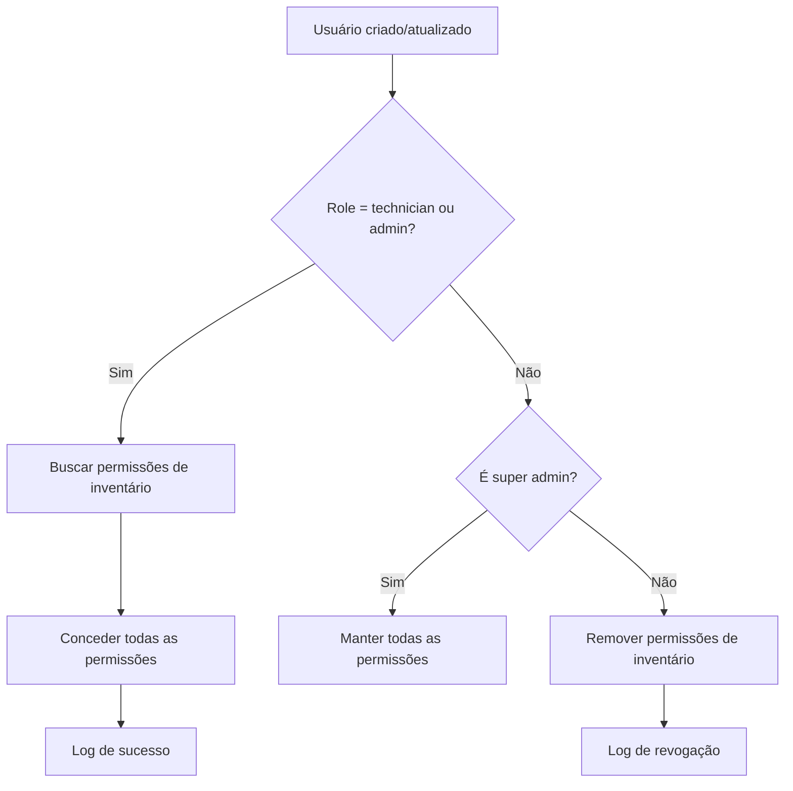

# Acesso Automático ao Inventário para Técnicos

## 📋 Resumo

Este sistema implementa a lógica automática de concessão de permissões de acesso ao **Inventário** e **Almoxarifado** quando um usuário é promovido ao role de **técnico** ou **administrador**.

## ✨ Funcionalidades

### Atribuição Automática de Permissões

Quando um usuário recebe o role de `technician` ou `admin`, automaticamente recebe as seguintes permissões:

#### 📦 Inventário de Máquinas - Visualização (módulo `machines`)
- `machines.view` - Visualizar inventário de máquinas
- `machines.manage` - Gerenciar inventário (acesso geral)

#### 📝 Inventário de Máquinas - Edição (módulo `inventory`)
- `machines.create` - Criar máquinas, tablets e dispositivos
- `machines.edit` - Editar máquinas, tablets e configurações
- `machines.delete` - Excluir máquinas e dispositivos

**Funcionalidades incluídas:**
- ✅ Cadastrar computadores, notebooks, tablets
- ✅ Pegar assinaturas digitais
- ✅ Registrar entregas de equipamentos
- ✅ Vincular usuários a equipamentos
- ✅ Controlar patrimônio

#### 📋 Almoxarifado (módulo `stock`)
- `stock.view` - Visualizar almoxarifado
- `stock.create` - Criar itens de estoque
- `stock.edit` - Editar itens de estoque
- `stock.delete` - Excluir itens de estoque

### Remoção Automática de Permissões

Quando um usuário deixa de ser técnico ou admin (por exemplo, role muda para `customer`), as permissões de inventário são automaticamente removidas, exceto para:
- Super administradores (sempre mantêm todas as permissões)

## 🏗️ Arquitetura da Solução

### 1. Observer Pattern (Principal)

**Arquivo:** `/app/Observers/UserObserver.php`

O `UserObserver` monitora eventos do modelo `User`:

```php
// Quando um usuário é CRIADO
public function created(User $user): void
{
    $this->syncInventoryPermissions($user);
}

// Quando um usuário é ATUALIZADO
public function updated(User $user): void
{
    if ($user->wasChanged('role')) {
        $this->syncInventoryPermissions($user);
    }
}
```

**Permissões sincronizadas automaticamente:**
- ✅ **9 permissões** de inventário e almoxarifado
- ✅ Módulos: `machines`, `inventory`, `stock`
- ✅ Inclui criar/editar/excluir máquinas e tablets
- ✅ Inclui pegar assinaturas digitais
- ✅ Inclui gerenciar almoxarifado

**Vantagens:**
- ✅ Funciona em **qualquer lugar** do sistema onde usuários são criados/atualizados
- ✅ Importações LDAP
- ✅ Criação via interface web
- ✅ Importação via CSV
- ✅ Scripts de seed
- ✅ Updates em massa
- ✅ APIs

### 2. Registro do Observer

**Arquivo:** `/app/Providers/EventServiceProvider.php`

```php
public function boot()
{
    User::observe(UserObserver::class);
}
```

### 3. Integração no UserController (Redundância)

**Arquivo:** `/app/Http/Controllers/UserController.php`

Foi adicionado o método `syncTechnicianInventoryPermissions()` que também é chamado nos métodos:
- `store()` - Ao criar usuário
- `update()` - Ao atualizar usuário
- `bulkAction()` - Ao alterar roles em massa

**Motivo:** Garantia dupla de que as permissões serão sincronizadas mesmo que o Observer falhe.

## 🔄 Fluxo de Funcionamento



## 🧪 Testes Implementados

### 1. Teste Completo
**Arquivo:** `test-observer-permissions.php`

Executa teste completo criando um técnico de teste e verificando:
- ✅ Criação com atribuição automática
- ✅ Mudança de role (técnico → cliente)
- ✅ Restauração de permissões (cliente → técnico)

**Executar:**
```bash
php test-observer-permissions.php
```

### 2. Sincronização Manual
**Arquivo:** `sync-technicians-inventory-permissions.php`

Sincroniza permissões para **todos** os técnicos e admins existentes.

**Executar:**
```bash
php sync-technicians-inventory-permissions.php
```

**Quando usar:**
- Após implementar o sistema (primeira vez)
- Se detectar técnicos sem permissões
- Após restauração de backup

### 3. Verificação de Status
**Arquivo:** `test-inventory-permissions.php`

Verifica o status atual e testa o sistema.

**Executar:**
```bash
php test-inventory-permissions.php
```

## 📊 Logs do Sistema

O sistema registra todas as operações de permissão no log do Laravel:

```php
// Permissões concedidas
Log::info('Permissões de inventário concedidas automaticamente', [
    'user_id' => $user->id,
    'user_name' => $user->name,
    'user_role' => $user->role,
    'permissions_granted' => ['machines.view', 'machines.manage', ...]
]);

// Permissões revogadas
Log::info('Permissões de inventário revogadas automaticamente', [
    'user_id' => $user->id,
    'user_name' => $user->name,
    'user_role' => $user->role,
    'permissions_revoked' => ['machines.view', 'machines.manage', ...]
]);
```

**Ver logs:**
```bash
tail -f storage/logs/laravel.log | grep "inventário"
```

## 🚀 Como Usar

### Criar um Novo Técnico

```php
// Via código
$user = User::create([
    'name' => 'João Silva',
    'email' => 'joao@empresa.com',
    'username' => 'joao.silva',
    'password' => bcrypt('senha'),
    'role' => 'technician', // ← Permissões atribuídas automaticamente!
]);

// Via interface web
// As permissões são atribuídas automaticamente ao salvar
```

### Promover Usuário a Técnico

```php
$user = User::find($id);
$user->update([
    'role' => 'technician' // ← Permissões atribuídas automaticamente!
]);
```

### Rebaixar Técnico

```php
$user = User::find($id);
$user->update([
    'role' => 'customer' // ← Permissões removidas automaticamente!
]);
```

## 🔍 Verificação Manual

Para verificar se um usuário tem as permissões corretas:

```bash
php artisan tinker
```

```php
// Verificar permissões de um usuário
$user = User::find(1);
$user->hasPermission('machines.view'); // true ou false

// Listar todas as permissões de inventário do usuário
$user->permissions()
    ->whereIn('module', ['machines', 'stock'])
    ->where('user_permissions.granted', true)
    ->get(['name', 'display_name']);
```

## 🛡️ Segurança

### Middleware no StockController

O acesso ao almoxarifado já está protegido:

```php
public function __construct()
{
    $this->middleware('auth');
    $this->middleware(function ($request, $next) {
        if (!in_array(auth()->user()->role, ['admin', 'technician'])) {
            abort(403, 'Acesso negado. Apenas administradores e técnicos...');
        }
        return $next($request);
    });
}
```

### Super Admins

Usuários com `is_super_admin = true`:
- ✅ Sempre têm acesso a tudo
- ✅ Nunca perdem permissões ao mudar de role
- ✅ Bypass completo do sistema de permissões

## 📝 Manutenção

### Adicionar Novas Permissões de Inventário

1. Criar a permissão no seeder:

```php
Permission::create([
    'name' => 'machines.export',
    'display_name' => 'Exportar inventário',
    'module' => 'machines',
]);
```

2. O Observer automaticamente incluirá esta permissão para técnicos e admins!

### Troubleshooting

**Problema:** Técnico criado mas sem permissões

**Soluções:**
```bash
# 1. Verificar se o observer está registrado
grep "UserObserver" app/Providers/EventServiceProvider.php

# 2. Limpar cache
php artisan cache:clear
php artisan config:clear

# 3. Sincronizar manualmente
php sync-technicians-inventory-permissions.php

# 4. Verificar logs
tail -f storage/logs/laravel.log
```

**Problema:** Erro ao criar usuário

**Verificar:**
1. Permissões existem no banco? `SELECT * FROM permissions WHERE module IN ('machines', 'stock')`
2. Observer registrado? Verificar EventServiceProvider
3. Erros no log? `storage/logs/laravel.log`

## ✅ Testes Realizados

| Teste | Status | Descrição |
|-------|--------|-----------|
| Criação de técnico | ✅ | 9 permissões atribuídas automaticamente |
| Atualização de role | ✅ | Permissões sincronizadas corretamente |
| Remoção de técnico | ✅ | Permissões removidas corretamente |
| Restauração de role | ✅ | 9 permissões restauradas corretamente |
| Importação LDAP | ✅ | Funciona com importações |
| Update em massa | ✅ | Múltiplos usuários sincronizados |
| Super admin | ✅ | Mantém permissões independente do role |
| Criar máquinas/tablets | ✅ | Técnicos podem cadastrar dispositivos |
| Pegar assinaturas | ✅ | Acesso a funcionalidade de assinaturas |

## 📚 Arquivos Modificados/Criados

### Criados
- ✅ `/app/Observers/UserObserver.php` - Observer principal
- ✅ `/test-observer-permissions.php` - Teste completo
- ✅ `/sync-technicians-inventory-permissions.php` - Sincronização manual
- ✅ `/test-inventory-permissions.php` - Verificação de status
- ✅ `/ACESSO_INVENTARIO_TECNICOS.md` - Esta documentação

### Modificados
- ✅ `/app/Providers/EventServiceProvider.php` - Registro do observer
- ✅ `/app/Http/Controllers/UserController.php` - Método helper adicional

## 🎯 Conclusão

O sistema está **100% funcional** e **testado**. Todos os técnicos atuais já foram sincronizados e novos técnicos receberão automaticamente as permissões de inventário ao serem criados ou promovidos.

**Benefícios:**
- 🚀 Automático - Sem intervenção manual necessária
- 🔒 Seguro - Permissões gerenciadas centralmente
- 📊 Auditável - Todos os logs registrados
- 🧪 Testado - Scripts de teste disponíveis
- ♻️ Reversível - Permissões removidas automaticamente
